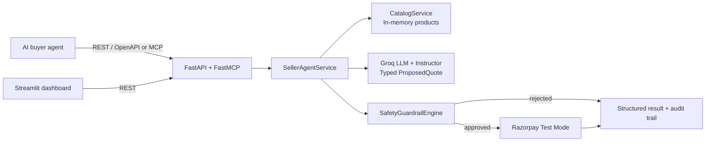

# Why this project exists

Traditional online stores are designed for people: browse pages, compare products, add to cart, and check out. That breaks down when the buyer is an AI assistant, procurement bot, or autonomous shopping agent. These systems need a machine-readable catalog, a structured way to negotiate within a mandate, and a payment path that is safe by design.

# Live Demo & Demo Mode Notice

> 🚀 **Try the Live App:** [https://razormcp.streamlit.app/](https://razormcp.streamlit.app/)

The public live deployment runs with **`DEMO_MODE=true`** enabled by default. So it's a mock, I really don't want exhaust my keys.

# Razorpay Agentic Seller Gateway

> A machine-to-machine commerce gateway where AI buyer agents discover products, receive a structured margin-aware offer, pass deterministic guardrails, and create Razorpay Test Mode orders — without a human checkout flow.

Built for **Razorpay Buildathon — Track 01: AI Growth & Agentic Commerce**.

## What it demonstrates

- **Agent-ready storefront:** REST/OpenAPI and MCP tools expose catalog search and an atomic purchase workflow.
- **Autonomous seller reasoning:** Groq-hosted, OpenAI-compatible LLM inference selects products, proposes bundles, and returns a typed `ProposedQuote` through Instructor.
- **Hard payment boundaries:** Pydantic guardrails validate transaction caps, buyer budget, discount policy, SKU validity, and stock before Razorpay is called.
- **Traceable decisions:** every purchase response includes an ordered audit trail from buyer intent to payment-order creation or rejection.
- **Demo-friendly UI:** a Streamlit dashboard makes the end-to-end transaction flow easy to inspect live.

## Architecture at a glance



Read the full component map, data flow, API contracts, and security notes in [docs/ARCHITECTURE.md](docs/ARCHITECTURE.md).
For the Railway deployment runbook, see [docs/HOSTING.md](docs/HOSTING.md).

## Quick start

**Requirements:** Python 3.10+ and credentials for Groq plus Razorpay **Test Mode**.

```bash
git clone <your-github-repository-url>
cd Backend

python -m venv .venv
source .venv/bin/activate          # Windows PowerShell: .venv\Scripts\Activate.ps1
pip install -r requirements.txt

cp .env.example .env
```

Fill in `.env` with your own credentials. Do not commit it.

```bash
# Terminal 1 — API and MCP server
uvicorn app.main:app --reload --host 0.0.0.0 --port 8000

# Terminal 2 — optional transaction inspector
streamlit run app/dashboard.py --server.port 8501
```

| Service | URL |
| --- | --- |
| Swagger / OpenAPI UI | http://localhost:8000/docs |
| ReDoc | http://localhost:8000/redoc |
| OpenAPI JSON | http://localhost:8000/openapi.json |
| Health check | http://localhost:8000/health |
| MCP endpoint | http://localhost:8000/mcp |
| Streamlit dashboard | http://localhost:8501 |

## Configuration

Copy `.env.example` to `.env` and configure the following values.

| Variable | Required | Purpose |
| --- | --- | --- |
| `RAZORPAY_KEY_ID` | Yes for successful orders | Razorpay **Test Mode** key ID |
| `RAZORPAY_KEY_SECRET` | Yes for successful orders | Razorpay Test Mode secret |
| `GROQ_API_KEY` | Yes for seller negotiation | API key for the OpenAI-compatible Groq endpoint |
| `LLM_MODEL` | No | Model identifier; defaults to `gpt-oss-120b` in code |
| `LLM_BASE_URL` | No | Defaults to `https://api.groq.com/openai/v1` |
| `MAX_DISCOUNT_PERCENTAGE` | No | Merchant discount ceiling; defaults to `20.0` |
| `MAX_TRANSACTION_LIMIT_INR` | No | Per-transaction merchant cap; defaults to `10000.0` |
| `ENVIRONMENT` | No | Runtime label returned by `/health` |
| `DEMO_MODE` | Recommended in public deployments | Simulates successful checked-out orders locally; no Groq or Razorpay call |
| `CORS_ORIGINS` | Recommended in production | Comma-separated trusted dashboard URLs, or `*` for local development |

> The `.gitignore` deliberately excludes `.env`, virtual environments, private keys, logs, and Streamlit secrets. If a credential has ever been committed, revoke and rotate it; adding it to `.gitignore` does not remove it from Git history.

## API surface

| Method | Route / tool | Description |
| --- | --- | --- |
| `GET` | `/health` | Liveness and active guardrail limits |
| `GET` | `/api/v1/catalog/search?query=keyboard&max_price=5000` | Keyword catalog discovery |
| `POST` | `/api/v1/agent/process-intent` | Intent → quote → guardrails → Razorpay order |
| MCP | `search_catalog(query, max_price?)` | MCP-native catalog discovery |
| MCP | `process_agentic_purchase(buyer_agent_id, query, max_budget_inr)` | MCP-native atomic purchase workflow |

### MCP tool safety metadata

Both MCP tools declare all four standard MCP safety hints. `search_catalog` is
read-only, idempotent, and local to the server's in-memory catalog.
`process_agentic_purchase` may create a Razorpay Test Mode order, so clients
must treat it as state-changing, non-idempotent, and capable of contacting an
external service. MCP hosts can use these declarations to warn users before
invocation.

Example request:

```bash
curl -X POST http://localhost:8000/api/v1/agent/process-intent \
  -H 'Content-Type: application/json' \
  -d '{
    "buyer_agent_id": "demo-buyer-01",
    "query": "silent mechanical keyboard with a wrist rest",
    "max_budget_inr": 5000
  }'
```

The response has a `SUCCESS`, `GUARDRAIL_REJECTED`, or `ERROR` status and always carries `validation_details` plus an `audit_trail`.

## Validation and demos

```bash
python test_phase2.py      # catalog and deterministic guardrails; no external call
python test_phase4.py      # FastAPI contract; full success needs a configured LLM/payment path
python test_phase3.py      # seller-agent flow; may create a Razorpay Test Mode order
python test_razorpay.py    # creates a Razorpay Test Mode order
python test_mcp_tools.py   # MCP tool names and mandatory safety metadata
```

The last two scripts can contact external services and create Test Mode payment orders. Use only with credentials you control.

## Repository layout

```text
app/
  main.py                  FastAPI routes and FastMCP tool registration
  config.py                Typed environment configuration
  dashboard.py             Streamlit transaction inspector
  core/                    Guardrails and Razorpay adapter
  services/                Catalog and seller orchestration
docs/
  ARCHITECTURE.md          Complete technical architecture
  PHASE*_IMPLEMENTATION.md Build-phase notes
requirements.txt           Runtime dependencies
.env.example               Safe configuration template
```

## GitHub checklist

```bash
git init                         # only if this folder is not already a Git repository
git add README.md .gitignore .env.example app docs requirements.txt test_*.py
git status                       # verify .env and virtual environments are absent
git commit -m "docs: prepare agentic seller gateway for GitHub"
git branch -M main
git remote add origin <your-github-repository-url>
git push -u origin main
```

Before publishing, inspect `git status --ignored` and search staged files for any real key or order/customer data.

## Project status and next steps

This is a prototype using an in-memory catalog and Razorpay Test Mode. A production evolution should add persistent inventory/orders, quote expiry, authenticated agent identity and spend mandates, webhook verification and fulfillment, rate limits, restricted CORS, and durable audit storage.

---

Made for a future where commerce APIs serve agents as naturally as they serve people.
