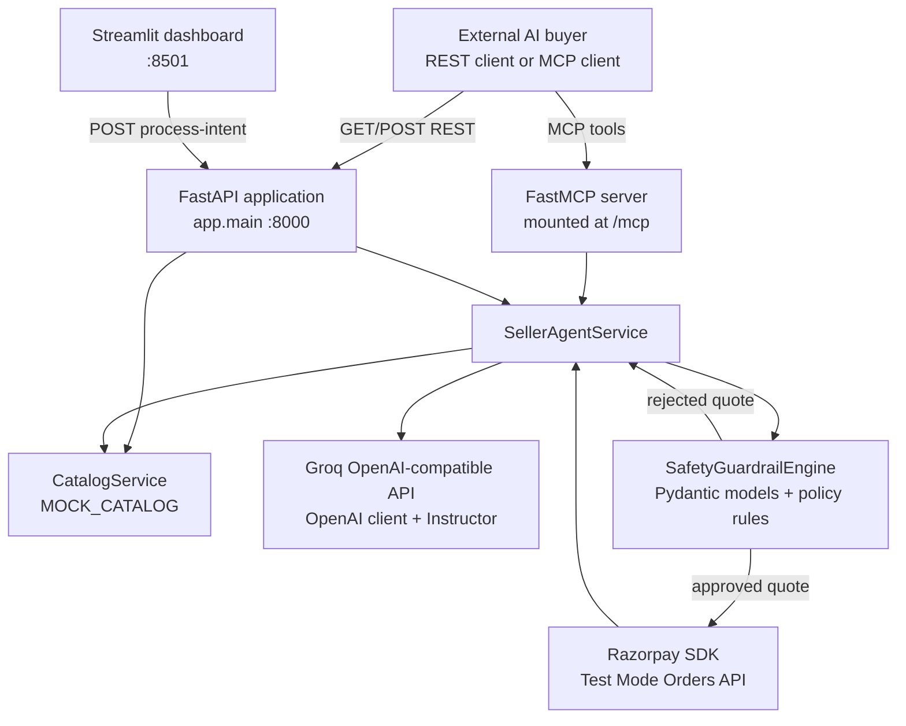
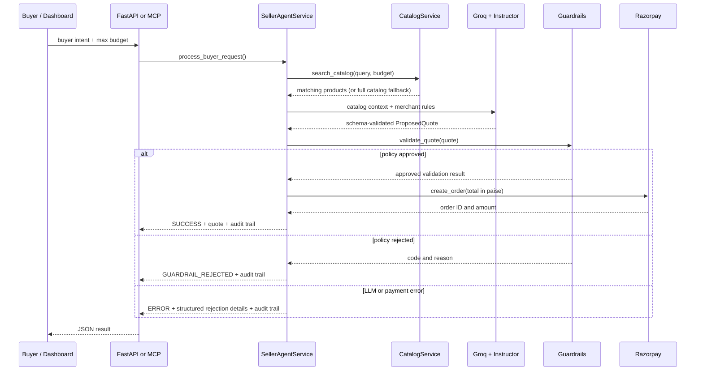

# Architecture: Razorpay Agentic Seller Gateway

## 1. Purpose and scope

The gateway is a seller-side prototype for agentic commerce. It lets an AI buyer submit a natural-language shopping intent and a maximum authorized budget. The system discovers matching catalog items, asks an LLM to produce a structured offer, verifies that offer against non-negotiable merchant policy, and only then asks Razorpay Test Mode to create an order.

The central trust boundary is intentional: **the LLM can recommend a quote but cannot directly create a payment order.** `SafetyGuardrailEngine` is the deterministic gate between model output and Razorpay.

## 2. Runtime topology



The API process and dashboard are separate processes. The dashboard currently targets `http://localhost:8000`; deployers should make that base URL configurable before hosting the UI elsewhere.

## 3. Components and responsibilities

| Area | Source | Responsibility | Dependencies |
| --- | --- | --- | --- |
| Application boundary | `app/main.py` | FastAPI setup, CORS, REST routes, OpenAPI docs, FastMCP mount | FastAPI, FastMCP |
| Configuration | `app/config.py` | Loads environment values into typed settings | pydantic-settings |
| Catalog | `app/services/catalog.py` | Defines `Product`, mock inventory, SKU lookups, keyword/price search | Pydantic |
| Seller workflow | `app/services/seller_agent.py` | Orchestrates intent, catalog context, LLM quote, guardrails, order creation, audit trail | Instructor, OpenAI client |
| Policy boundary | `app/core/guardrails.py` | Defines quote models and validates merchant/buyer constraints | Pydantic |
| Payment adapter | `app/core/razorpay_client.py` | Wraps Razorpay orders, payment links, and signature validation | Razorpay SDK |
| Demo surface | `app/dashboard.py` | Collects a sample buyer intent and displays the returned decision trail | Streamlit, Requests |
| Tests/scripts | `test_phase*.py`, `test_razorpay.py` | Runnable verification scripts for individual layers and integrations | FastAPI TestClient / services |

## 4. Interfaces

### REST API

| Method | Path | Input | Output |
| --- | --- | --- | --- |
| `GET` | `/health` | None | Runtime environment and configured caps |
| `GET` | `/api/v1/catalog/search` | `query` required; optional `max_price` | Array of `Product` records |
| `POST` | `/api/v1/agent/process-intent` | `BuyerIntentRequest` | `AgenticTransactionResult` |

FastAPI publishes the same route schemas at `/openapi.json`, `/docs`, and `/redoc`.

### MCP tools

The FastMCP application is mounted at `/mcp` and exposes:

| Tool | Arguments | Result |
| --- | --- | --- |
| `search_catalog` | `query`, optional `max_price` | List of serialized products |
| `process_agentic_purchase` | `buyer_agent_id`, `query`, `max_budget_inr` | Serialized transaction result |

### Core data contracts

```text
BuyerIntentRequest
├── buyer_agent_id: str
├── query: str
└── max_budget_inr: float

ProposedQuote
├── buyer_agent_id: str
├── items: list[QuoteItem(sku, quantity, unit_price_inr)]
├── original_total_inr: float
├── final_discounted_total_inr: float
├── applied_discount_percentage: float
├── buyer_max_budget_inr: float
├── upsell_applied: bool
└── reasoning: str

AgenticTransactionResult
├── status: SUCCESS | GUARDRAIL_REJECTED | ERROR
├── buyer_agent_id: str
├── razorpay_order_id?: str
├── amount_paid_inr?: float
├── applied_quote?: ProposedQuote
├── validation_details: GuardrailValidationResult
└── audit_trail: list[object]
```

## 5. Purchase lifecycle



Detailed execution:

1. `SellerAgentService` logs `INTENT_RECEIVED`.
2. `CatalogService.search_catalog()` performs case-insensitive keyword matching across product name, category, and description, applying the buyer's price cap when supplied.
3. If no products match, the workflow supplies all catalog entries to the model as a fallback candidate set.
4. The seller prompt includes SKU, price, margin, stock, merchant discount cap, and buyer budget. Instructor requests a `ProposedQuote`, rather than accepting unstructured prose.
5. The guardrail engine evaluates the generated quote. A failed check stops the workflow before any Razorpay call.
6. An approved final INR amount is converted to integer paise using `int(round(amount_inr * 100))`; Razorpay receives the order plus limited agent/quote metadata in `notes`.
7. The service returns a uniform result object. The audit trail records the lifecycle steps currently retained in memory for that response.

## 6. Guardrail policy

| Order | Rule | Failure code |
| --- | --- | --- |
| 1 | `final_discounted_total_inr` must not exceed `MAX_TRANSACTION_LIMIT_INR` | `EXCEEDED_GLOBAL_TRANSACTION_LIMIT` |
| 2 | Quote total must not exceed `buyer_max_budget_inr` | `EXCEEDED_BUYER_BUDGET` |
| 3 | Discount must not exceed `MAX_DISCOUNT_PERCENTAGE` | `EXCEEDED_MAX_DISCOUNT_CAP` |
| 4 | Every SKU must exist and have enough inventory | `INVALID_SKU` or `INSUFFICIENT_STOCK` |

The first failing rule is returned with a stable machine-readable `rejection_code` and a human-readable `rejection_reason`.

## 7. Technology choices

| Technology | Why it is used |
| --- | --- |
| Python | Single-language implementation for API, orchestration, and dashboard |
| FastAPI | Typed HTTP endpoints, request validation, and generated OpenAPI discovery |
| FastMCP | Standardized tool interface for MCP-capable buyer agents |
| Pydantic v2 | Input/output contracts, quote schemas, and settings types |
| pydantic-settings | Loads `.env` values into `Settings` |
| OpenAI Python SDK | Client abstraction for OpenAI-compatible Groq API |
| Groq | Configured inference provider for the seller model |
| Instructor | Turns model output into a validated `ProposedQuote` contract |
| Razorpay SDK | Test Mode order creation, payment-link support, signature verification |
| Streamlit + Requests | Lightweight interactive transaction inspector |
| Uvicorn | ASGI server for FastAPI |

Exact install ranges are maintained in [`../requirements.txt`](../requirements.txt).

## 8. Configuration and secrets

`Settings` reads `.env` in the repository root. The safe template is [`../.env.example`](../.env.example).

| Key | Used by | Notes |
| --- | --- | --- |
| `RAZORPAY_KEY_ID`, `RAZORPAY_KEY_SECRET` | `RazorpayService` | Use Test Mode for development and demos |
| `GROQ_API_KEY` | `SellerAgentService` | Needed when invoking seller-model negotiation |
| `LLM_MODEL`, `LLM_BASE_URL` | `SellerAgentService` | Enable provider/model configuration without code changes |
| `MAX_DISCOUNT_PERCENTAGE` | Guardrails and seller prompt | Policy ceiling |
| `MAX_TRANSACTION_LIMIT_INR` | Guardrails and health route | Absolute merchant limit |
| `ENVIRONMENT` | Health route | Runtime label |

`.env`, `.env.*`, key files, virtual environments, and local secrets are ignored by Git. The `.env.example` template is intentionally tracked. Never paste credentials into issues, documentation, screenshots, or commit messages.

## 9. Operational behavior and constraints

- **No persistence:** catalog, inventory, and audit trails live in process memory. A restart loses transaction history; stock is not decremented after an order.
- **Synchronous SDK calls:** Razorpay and model calls run in the request workflow. For production scale, isolate them behind asynchronous clients or jobs.
- **Permissive CORS:** the current `allow_origins=["*"]` is convenient for a demo but should be limited to trusted UI origins in deployment.
- **Test payments only:** order creation does not itself capture payment. Add signed webhook handling and fulfillment state before treating orders as paid.
- **Public demo mode:** `DEMO_MODE=true` keeps a portfolio deployment safe by generating a local, deterministic quote and simulated order after the same guardrail check. It never calls Groq or Razorpay; use `false` only in a controlled environment with protected credentials.
- **Input and output guardrails:** Pydantic checks request shape and tool output shape; the current policy validates caps, discounts, SKUs, and stock. Production should also reconcile item price/unit price and quote arithmetic, enforce positive budget values, and apply rate/spend limits per buyer identity.
- **Audit scope:** the returned `audit_trail` is useful for inspection but is not immutable durable storage. Persist events with request IDs, access controls, and retention policy for compliance-grade auditability.

## 10. Production evolution

1. Replace `MOCK_CATALOG` with a transactional database and reserve/decrement inventory atomically.
2. Add quote IDs, price snapshots, expiry, and server-side arithmetic verification.
3. Authenticate buyer agents; verify signed spending mandates and enforce per-agent rate and velocity limits.
4. Store orders and audit events durably; add traces, metrics, alerts, and redacted structured logs.
5. Restrict CORS, separate environments, rotate secrets, and use a managed secret store.
6. Verify Razorpay webhooks and drive fulfillment only from verified payment events.
7. Use asynchronous workers/retries with idempotency keys for payment-facing operations.

## 11. Local development map

```bash
python -m venv .venv
source .venv/bin/activate
pip install -r requirements.txt
cp .env.example .env

uvicorn app.main:app --reload --port 8000
# In another terminal:
streamlit run app/dashboard.py --server.port 8501
```

For an offline, deterministic check of catalog and policy behavior, run `python test_phase2.py`. See the root README for the full runbook and testing cautions.
